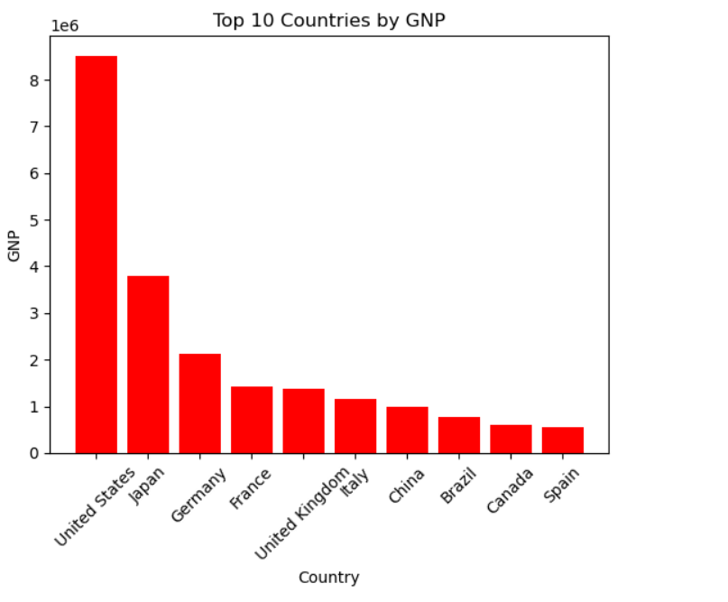
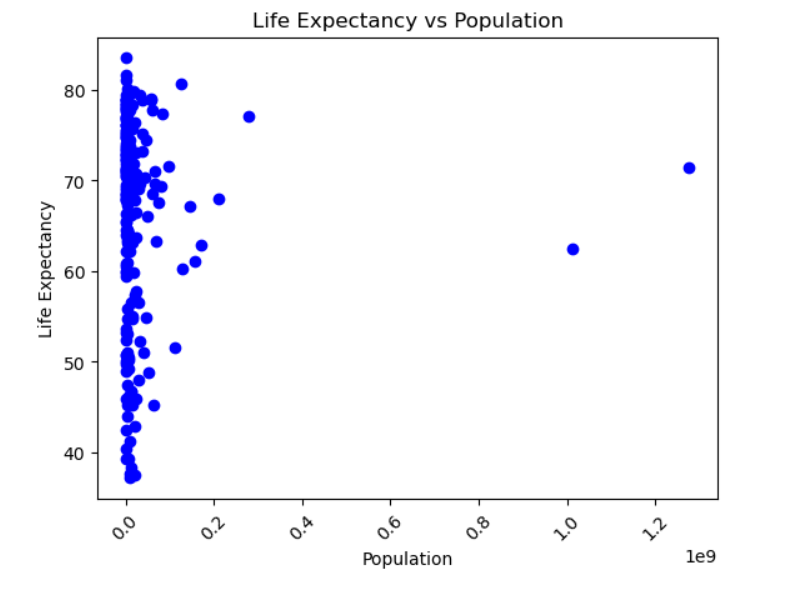
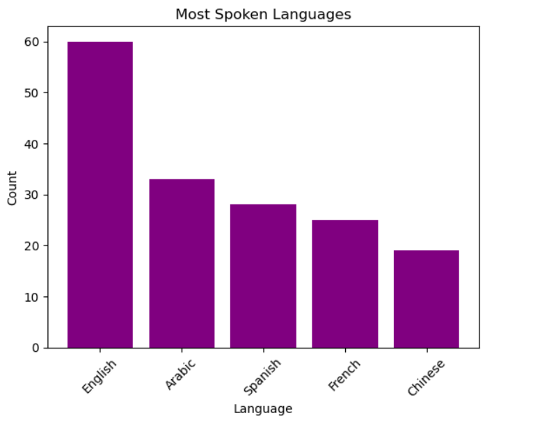
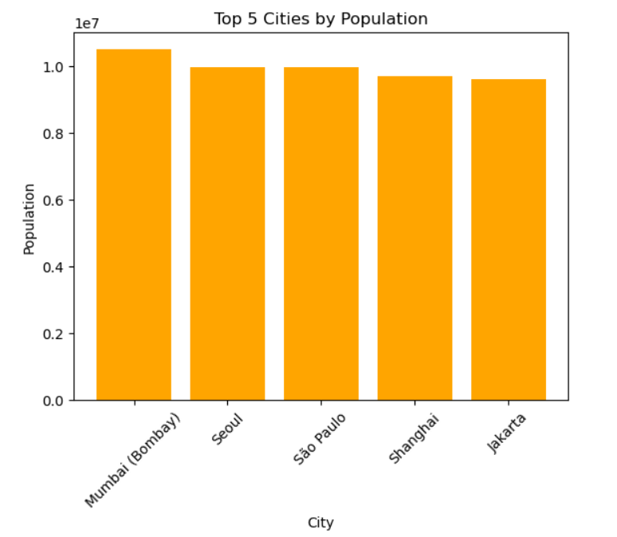
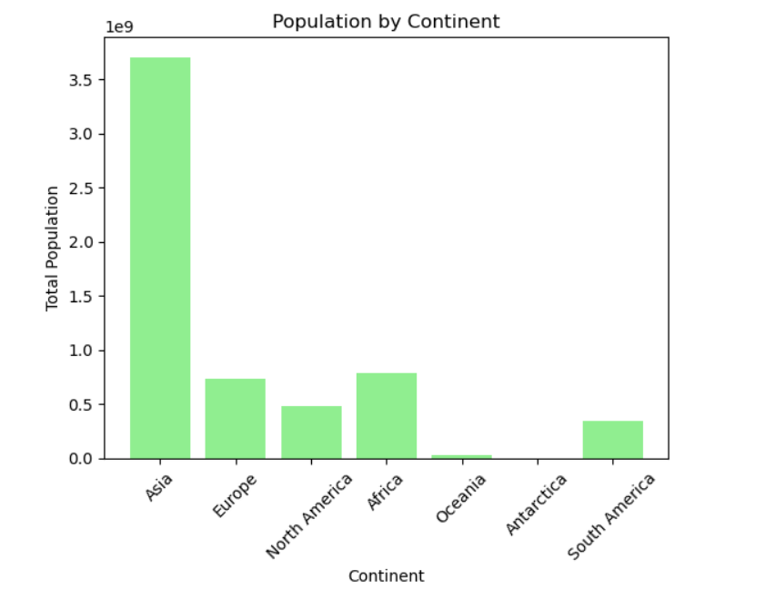
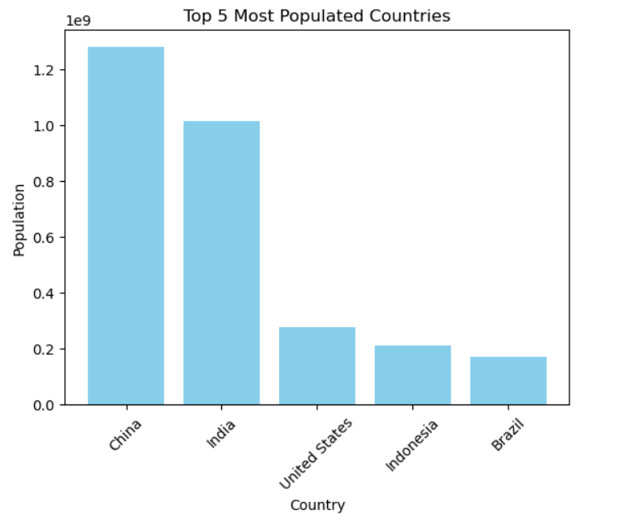
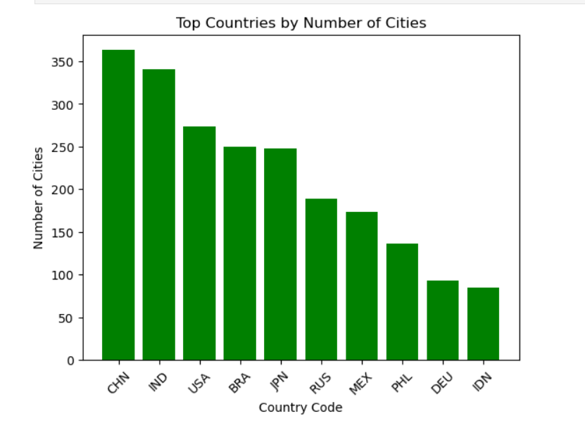
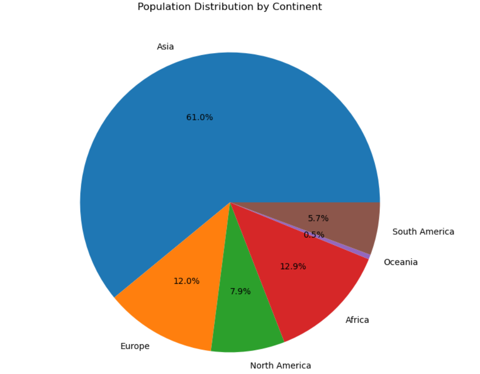

#  World Data Analysis using SQL & Python

##  Overview

This project analyzes the **World Database** using SQL and Python to extract meaningful insights about countries, cities, population, economy (GNP), and languages. The analysis combines SQL queries with Python libraries like Pandas and Matplotlib for visualization.

---

##  Objectives

* Perform data extraction using SQL queries
* Analyze global population distribution
* Study economic indicators like GNP
* Explore relationships between population and life expectancy
* Visualize data using graphs

---

##  Dataset

The project uses the **World Database**, which includes:

* **Country** → Population, GNP, Continent
* **City** → City population and country mapping
* **CountryLanguage** → Languages spoken in countries

---

##  Technologies Used

* MySQL
* Python
* Pandas
* Matplotlib

---

##  Data Visualization

### Top 10 Countries by GNP

### Life Expectancy vs Population

### Most Spoken Languages

### Top 5 Cities by Population

### Population by Continent

### Top 5 Most Populated Countries

### Countries by Number of Cities

### Population Distribution (Pie Chart)

---

##  Key Insights

* A small number of countries dominate global population, with China and India leading
* Asia contributes the largest share of the world population
* Urban cities have significantly higher population compared to smaller regions
* Countries with higher economic strength (GNP) are limited in number
* Certain languages are widely spoken across multiple countries, showing global influence
* Population and life expectancy show variation across regions

---

##  Conclusion

This project demonstrates how SQL and Python can be combined to perform effective data analysis. The insights reveal global trends in population, economy, urbanization, and language distribution.

---

##  Future Improvements

* Apply advanced SQL queries (joins, aggregations)
* Use machine learning for predictive analysis
* Build dashboards using Power BI or Tableau

---

##  Author

**Khushi Gupta**
B.Tech CSE (AI/ML Aspirant)

---
